## Базовая конфигурация

```text
n_estimators = 1500
max_depth = 5
subsample = 1.0
colsample_bytree = 1.0
```

## Сравнение разных learning_rate

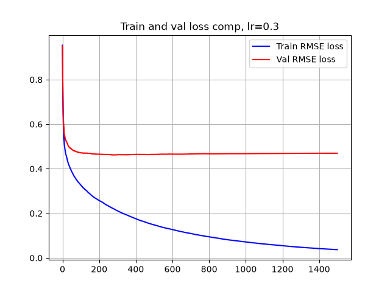

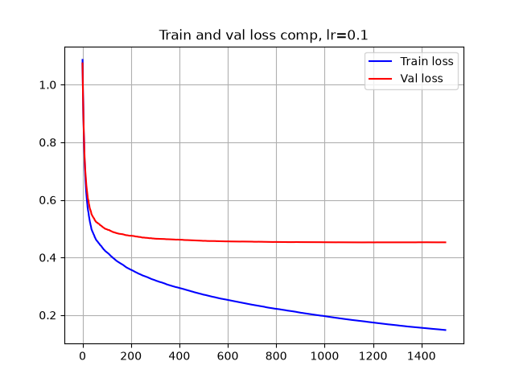

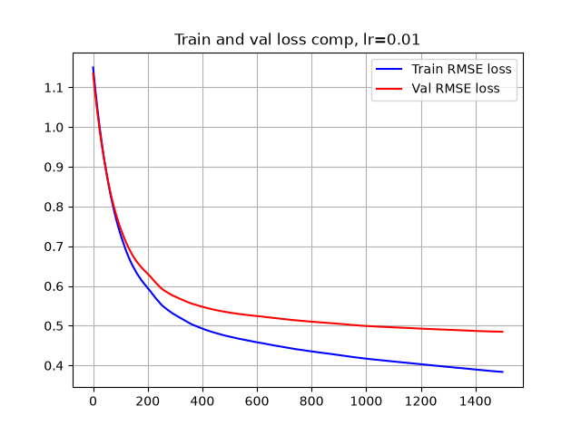

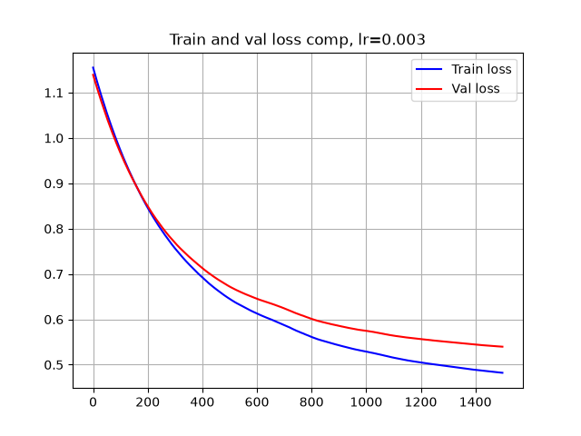

При learning_rate=0.3 модель быстро обучается, но примерно после нескольких сотен деревьев validation RMSE перестаёт уменьшаться и начинает расти, в то время как train RMSE продолжает снижаться. Это говорит о переобучении

При learning_rate=0.1 переобучение выражено слабее: validation RMSE постепенно выходит на плато, тогда как train RMSE продолжает снижаться.

При learning_rate=0.01 и 0.003 обе метрики к 1500-й итерации всё ещё уменьшаются, поэтому для этих значений необходимо увеличить число деревьев, прежде чем сравнивать их минимальный validation RMSE.

## Сравнение разных n_estimators

Следующие 6 графиков приведены при learning_rate=0.003

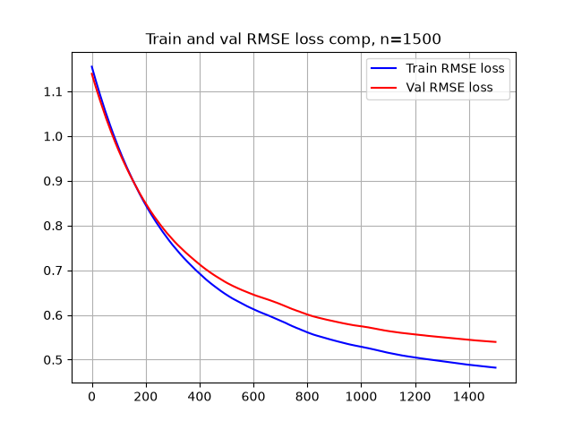

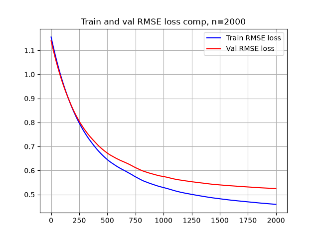

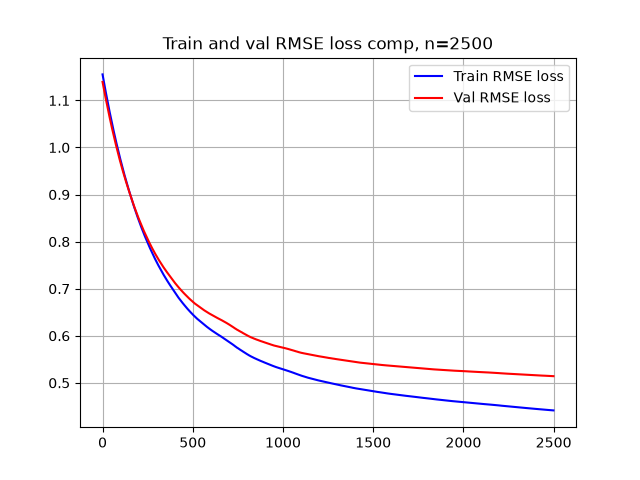

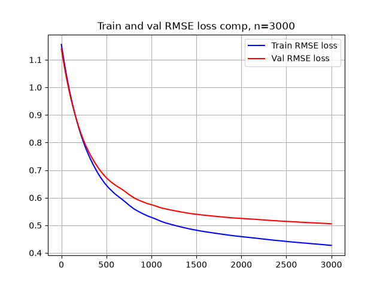

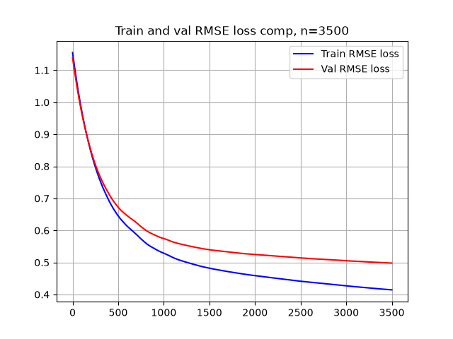

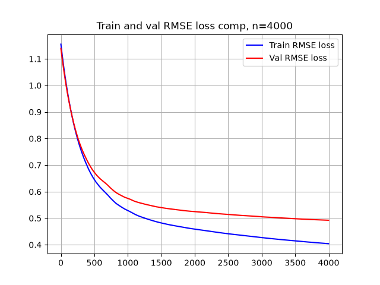

Следующие 6 графиков приведены при learning_rate=0.01

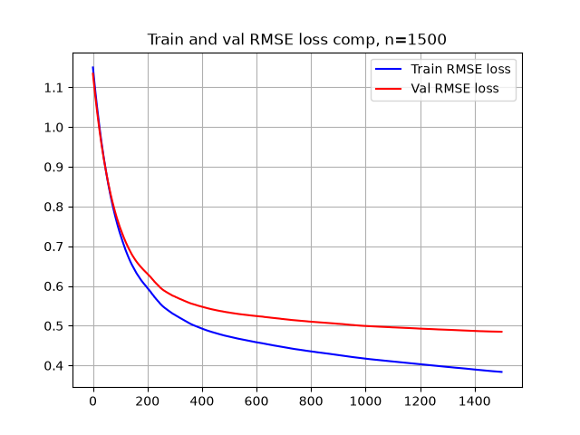

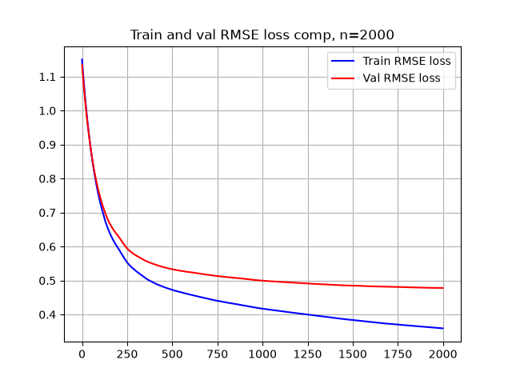

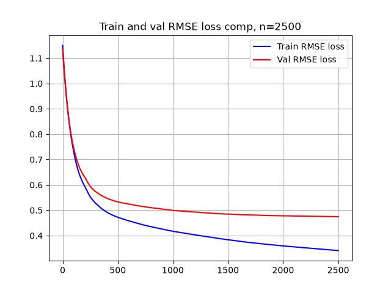

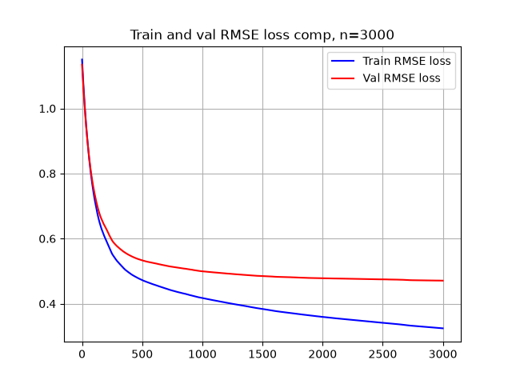

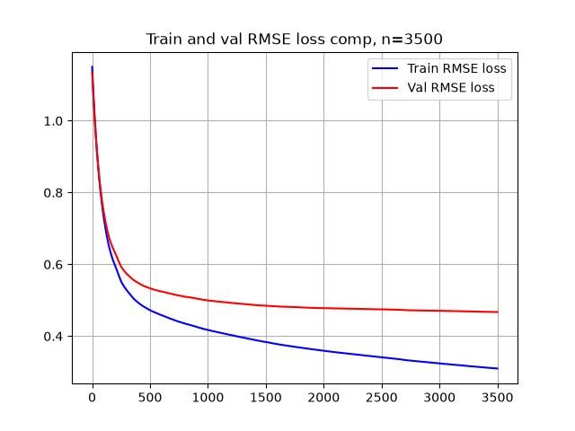

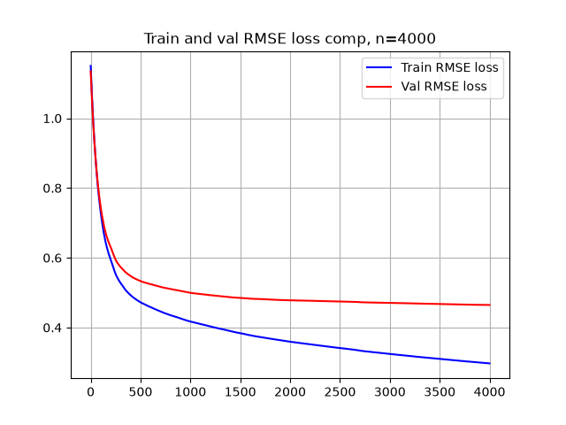

Для 0.003 после 2500 деревьев val_los остается в окрестности 0.5.

Для 0.01 после 1500 деревьев val_los остается чуть меньше 0.5 и стагнирует.

Можно сделать выводы, что для learning_rate=0.01 оптимальное количество деревьев равно 1500, так как дальше наблюдается переобучение, а использование learning_rate=0.003 нецелесообразно, так как даже при даже экстримельных значениях количества деревьев loss оказывается хуже, чем при learning_rate=0.01

Решено выбрать learning_rate=0.01 и n_estimators=1500