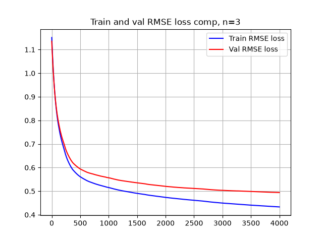
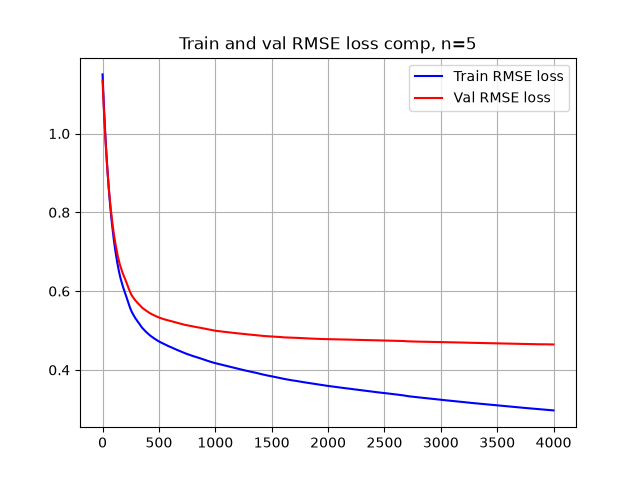
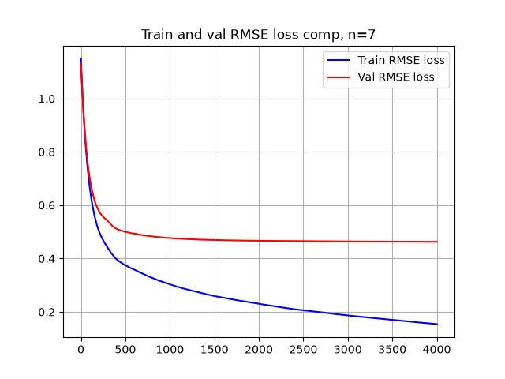
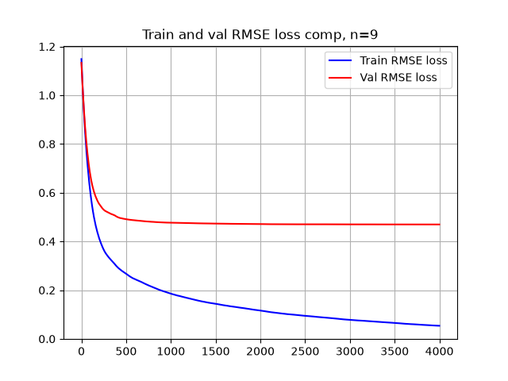
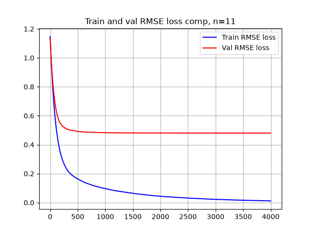
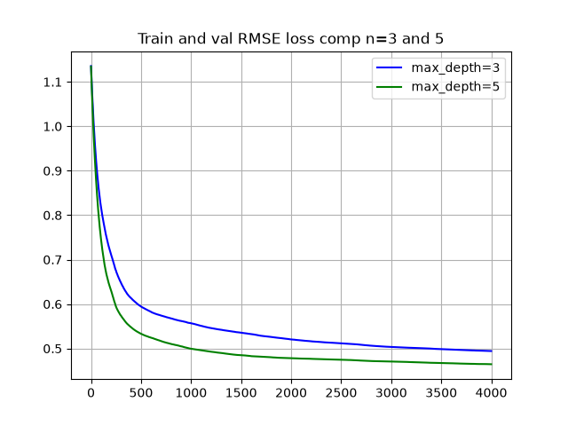

## Базовая конфигурация

```text
n_estimators = 1500
max_depth = 5
subsample = 1.0
colsample_bytree = 1.0
```

## Сравнение разных learning_rate


При learning_rate=0.3 модель быстро обучается, но примерно после нескольких сотен деревьев validation RMSE перестаёт уменьшаться и начинает расти, в то время как train RMSE продолжает снижаться. Это говорит о переобучении

При learning_rate=0.1 переобучение выражено слабее: validation RMSE постепенно выходит на плато, тогда как train RMSE продолжает снижаться.

При learning_rate=0.01 и 0.003 обе метрики к 1500-й итерации всё ещё уменьшаются, поэтому для этих значений необходимо увеличить число деревьев, прежде чем сравнивать их минимальный validation RMSE.

## Сравнение разных n_estimators

Следующие 6 графиков приведены при learning_rate=0.003


Следующие 6 графиков приведены при learning_rate=0.01


При `learning_rate=0.01` увеличение числа деревьев вплоть до 4000 продолжает уменьшать validation RMSE, поэтому явного переобучения по данному параметру пока не наблюдается. Однако после некоторого количества итераций улучшение становится всё менее значительным: для получения небольшого прироста качества требуется добавлять всё больше деревьев.

`learning_rate=0.003` показывает ещё более медленную сходимость и требует значительно большего числа деревьев для достижения сопоставимого качества, поэтому в дальнейших экспериментах решено оставить `learning_rate=0.01`.

Поскольку дальнейшее увеличение `n_estimators` даёт лишь небольшой прирост качества, следующим шагом будет исследование `max_depth`. Возможно, текущая глубина дерева `max_depth=5` ограничивает сложность базовых моделей, из-за чего для улучшения ансамбля требуется большое количество boosting-итераций. Для проверки этой гипотезы будут сравнены несколько значений `max_depth` при фиксированных остальных параметрах.

## Сравнение количества деревьев











При max_depth от 7 и выше явно замечено переобучение.

Надо наглядно сравнить val_los при max_depth 3 и 5.



Видно, что 5 лучше, чем 3. Переобучения не замечено. Решено оставить max_depth=5

## Вывод по валидации

Графики показали что при learning_rate=0.01, n_esimators=2000, max_depth=5 достигается лучший результат в компромиссе между точностью и вычислительной сложностью. Скорее всего лучше, чем val_loss=0.4718 достичь нельзя

## Общий вывод

```text
MSE: 0.20679840168163913
R2: 0.8123209773203957
```

Значит модель объясняет примерно 80% дисперсии и имеет ошибку примерно 20%. Возможно бустинг не лучшая модель в данной задаче